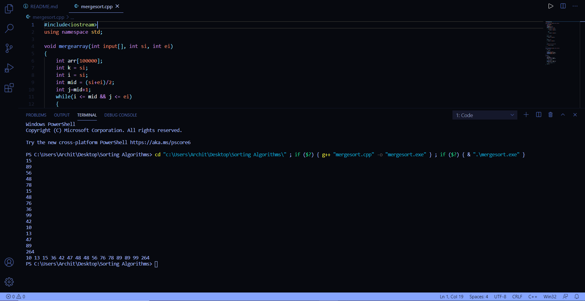
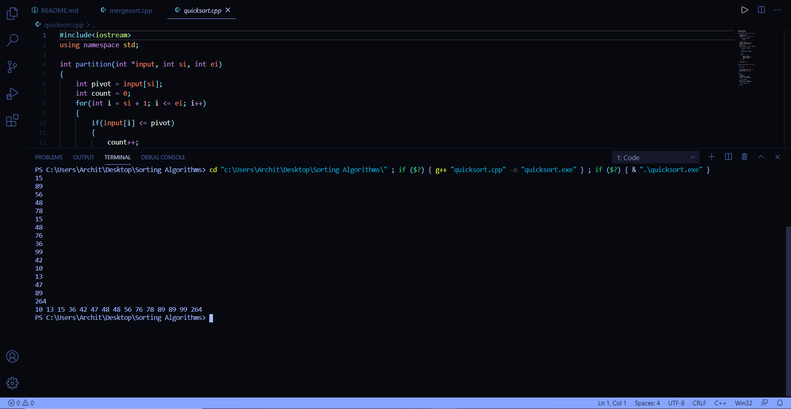

# Sorting Algorithms (In C++)

### Description
These are the sorting algorithms.  
Till now implemented:  
1. Merge Sort
2. Quick Sort
3. Bubble Sort
***
**Will be adding more soon**
***
Screenshots:  
1. Merge Sort:  

2. Quick Sort:

